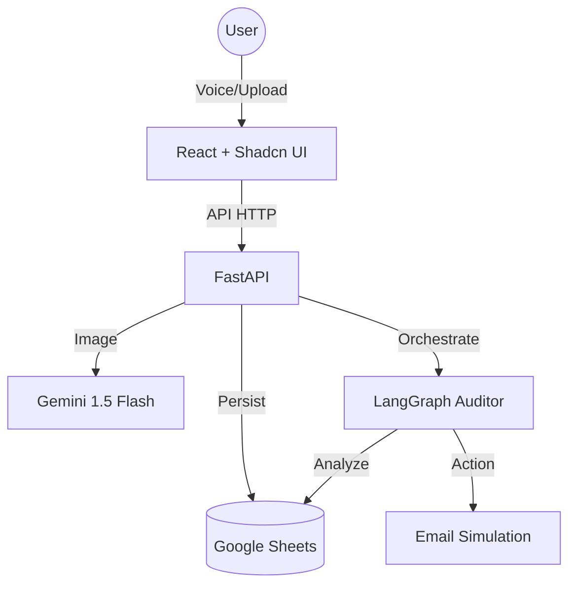

# Balance AI ⚖️
> **Autonomous Financial Controller for SMBs**

Balance AI is an agentic financial system that automates the "boring" parts of business: bookkeeping, risk analysis, and receivables management. It uses **Gemini Vision** to see invoices and **LangGraph** to think like a CFO.


## 🏗️ Architecture



## 🛠️ Tech Stack
- **Frontend**: React, Tailwind CSS, shadcn/ui, Recharts, Framer Motion
- **Backend**: FastAPI, Python 3.10+
- **AI Core**: Google Gemini 1.5 Flash (Vision + Reasoning)
- **Agent Framework**: LangGraph (Stateful Orchestration)
- **Database**: Google Sheets API (low-code, persistent)
- **Deployment**: Dockerized Containers

## 🚀 Setup Instructions

### Prerequisites
- Python 3.10+
- Node.js 18+
- Google Cloud API Key (Gemini)

### Installation
1. **Clone the repository**
   ```bash
   git clone <repo-url>
   cd Fintine
   ```
2. **Backend Setup**
   ```bash
   cd backend
   python -m venv venv
   source venv/bin/activate  # or venv\Scripts\activate on Windows
   pip install -r requirements.txt
   cp .env.example .env
   # Add your GEMINI_API_KEY
   ```
3. **Frontend Setup**
   ```bash
   cd ../frontend
   npm install
   ```
4. **Run Application**
   ```bash
   ./run_app.sh
   # Access at http://localhost:5173
   ```

## 🛡️ Responsible AI & Guardrails
- **Prompt Injection Defense**: The Agent runs with a strict "CFO Persona" system prompt that refuses to answer non-financial queries.
- **Hallucination Check**: We assume "Low Confidence" on low-res images and flag them for human review in the ledger (Status: 'Pending Review').
- **Bounded Scope**: The agent has read-only access to historical data and can only *draft* emails, not send them without approval (Human-in-the-loop).

## 🧪 Testing
Run backend unit tests:
```bash
cd backend
pytest tests/
```

## 🌍 Deployment
The project includes a `docker-compose.yml` for instant deployment.
```bash
docker-compose up --build
```

---
*Built for AgentxHackathon 2026*
