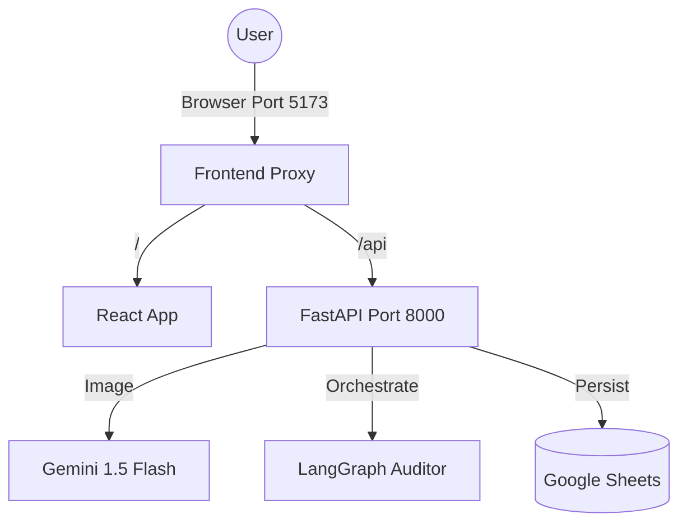

# Balance AI ⚖️
> **Autonomous Financial Controller for SMBs**

Balance AI is an agentic financial system that automates the "boring" parts of business: bookkeeping, risk analysis, and receivables management. It uses **Gemini 1.5 Flash** (Vision) to process invoices and **LangGraph** to autonomously audit finances.


## 🏗️ Architecture



## 🚀 Quick Start (Docker)

**Prerequisites**: Docker & Docker Compose.

1.  **Clone & Configure**
    ```bash
    git clone <repo-url>
    cd Fintine
    cp backend/.env.example backend/.env
    # Add your GEMINI_API_KEY in backend/.env
    # Ensure credentials.json is in backend/
    ```

2.  **Run with Docker** (Recommended)
    ```bash
    docker-compose up --build
    ```

3.  **Access App**
    -   **Frontend**: [http://localhost:5173](http://localhost:5173) (Use this!)
    -   **API Docs**: [http://localhost:5173/api/docs](http://localhost:5173/api/docs)

    > **Note**: The Frontend uses an Nginx Reverse Proxy to route `/api` calls to the backend. Do not try to access the backend via port 8000 directly from the browser to avoid CORS issues.

## 🛠️ Tech Stack
-   **Frontend**: React, Tailwind CSS, shadcn/ui, Nginx (Proxy)
-   **Backend**: FastAPI, Python 3.10+
-   **AI Core**: Google Gemini 1.5 Flash (Vision)
-   **Agent Framework**: LangGraph
-   **Database**: Google Sheets (Real Mode)

## 🧪 Testing & Development
To run unit tests inside the container:
```bash
docker-compose exec backend pytest tests/
```

## 🛡️ Responsible AI & Guardrails
-   **Strict Persona**: System prompts enforce a "CFO" role, rejecting non-financial queries.
-   **Visual Guardrails**: Gemini Vision validates if an image is actually a receipt before processing.
-   **Human-in-the-Loop**: All AI actions (emails, payments) require manual approval in the "Agent Terminal".

---
*Built for Hackathon 2026*
